# 図解集 — AIシフト作成アプリ「ShiftCraft」

> **最終更新**: 2026-04-06
> **関連ドキュメント**: `20260406_requirements.md` / `20260406_design.md`

---

## 目次

1. [システム構成図](#1-システム構成図)
2. [アーキテクチャ図（詳細）](#2-アーキテクチャ図詳細)
3. [画面遷移図](#3-画面遷移図)
4. [ER図（概念）](#4-er図概念)
5. [ER図（詳細）](#5-er図詳細)
6. [シーケンス図: AIシフト生成](#6-シーケンス図-aiシフト生成)
7. [シーケンス図: AIシフト生成（詳細）](#7-シーケンス図-aiシフト生成詳細)
8. [シーケンス図: 認証・認可](#8-シーケンス図-認証認可)
9. [シーケンス図: シフト編集（D&D）](#9-シーケンス図-シフト編集dd)
10. [シーケンス図: PDF出力](#10-シーケンス図-pdf出力)
11. [CI/CDパイプライン](#11-cicdパイプライン)

---

## 1. システム構成図

> 参照元: 要件定義書 §4.1

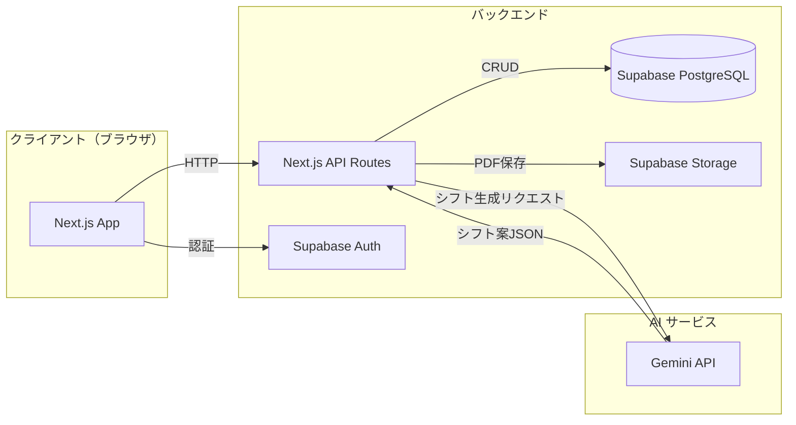

---

## 2. アーキテクチャ図（詳細）

> 参照元: 設計書 §1.2

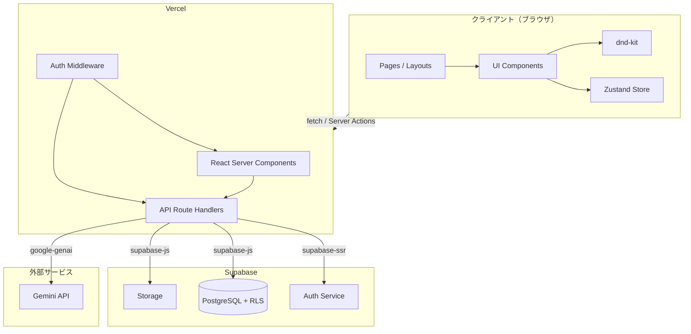

---

## 3. 画面遷移図

> 参照元: 要件定義書 §7.2

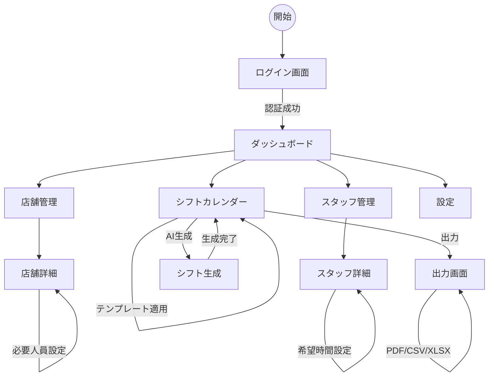

---

## 4. ER図（概念）

> 参照元: 要件定義書 §8.1

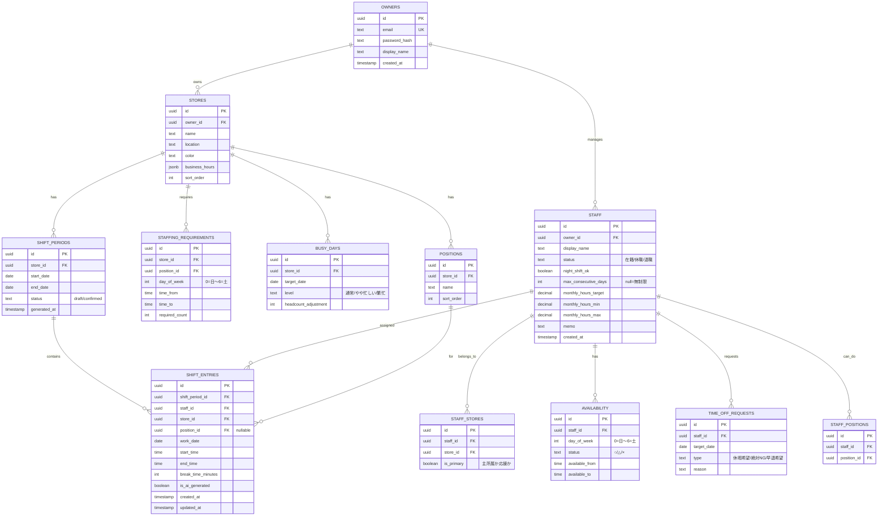

---

## 5. ER図（詳細）

> 参照元: 設計書 §2.1 — 実装レベルの型・制約・追加テーブルを含む

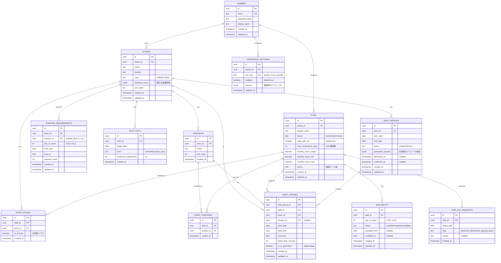

---

## 6. シーケンス図: AIシフト生成

> 参照元: 要件定義書 §6.4.1

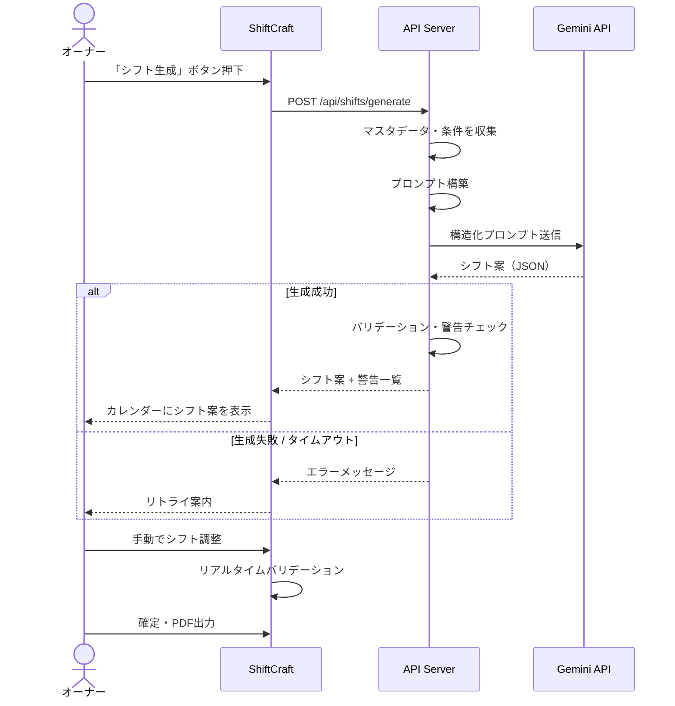

---

## 7. シーケンス図: AIシフト生成（詳細）

> 参照元: 設計書 §4.1

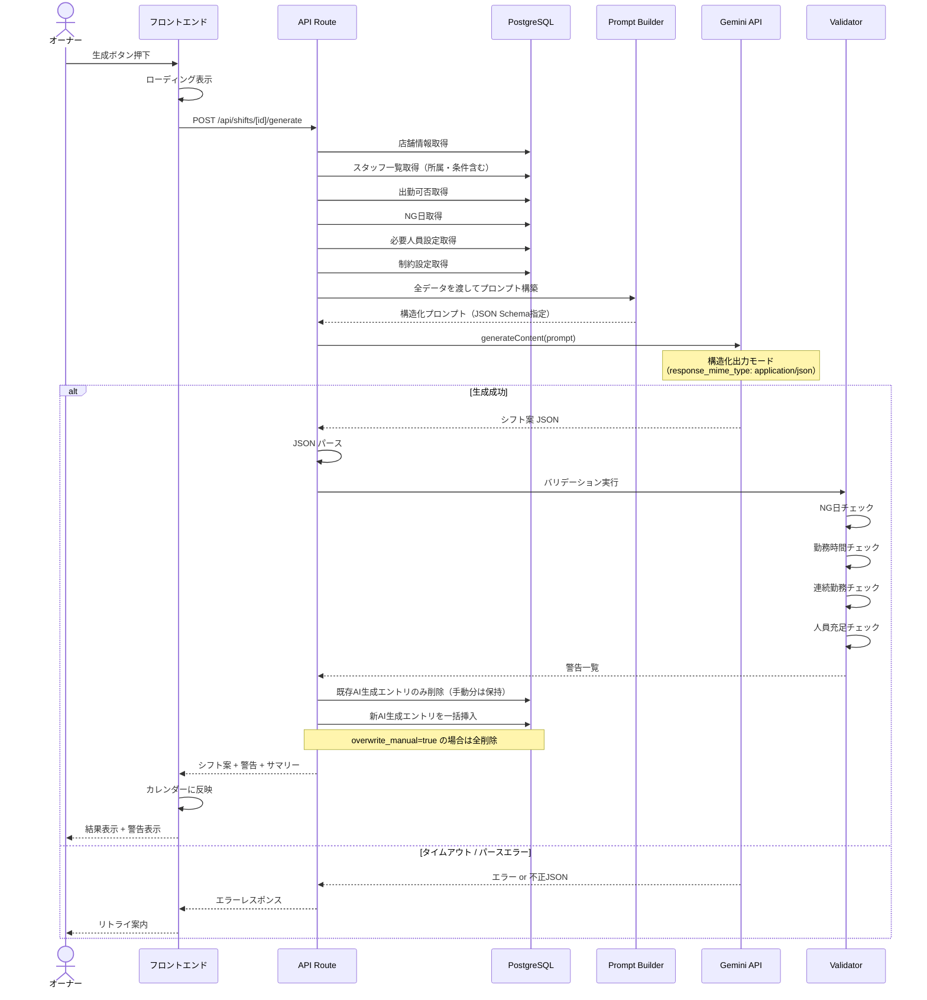

---

## 8. シーケンス図: 認証・認可

> 参照元: 設計書 §3.4

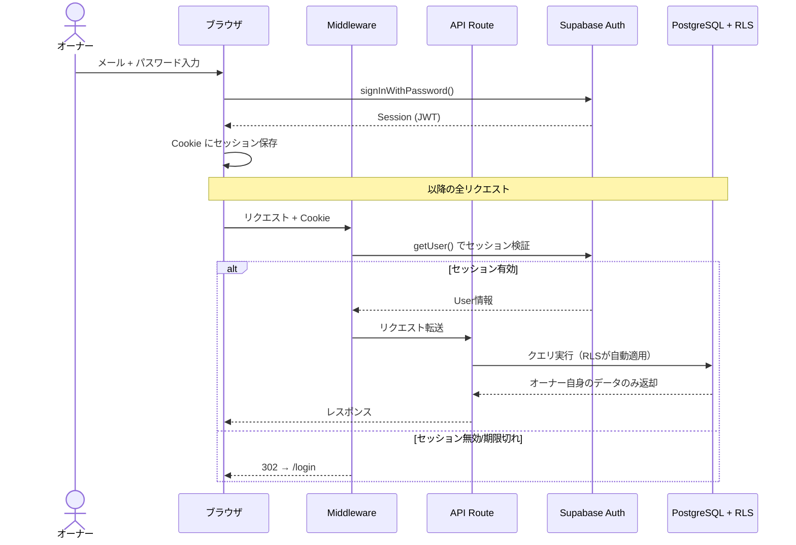

---

## 9. シーケンス図: シフト編集（D&D）

> 参照元: 設計書 §4.3

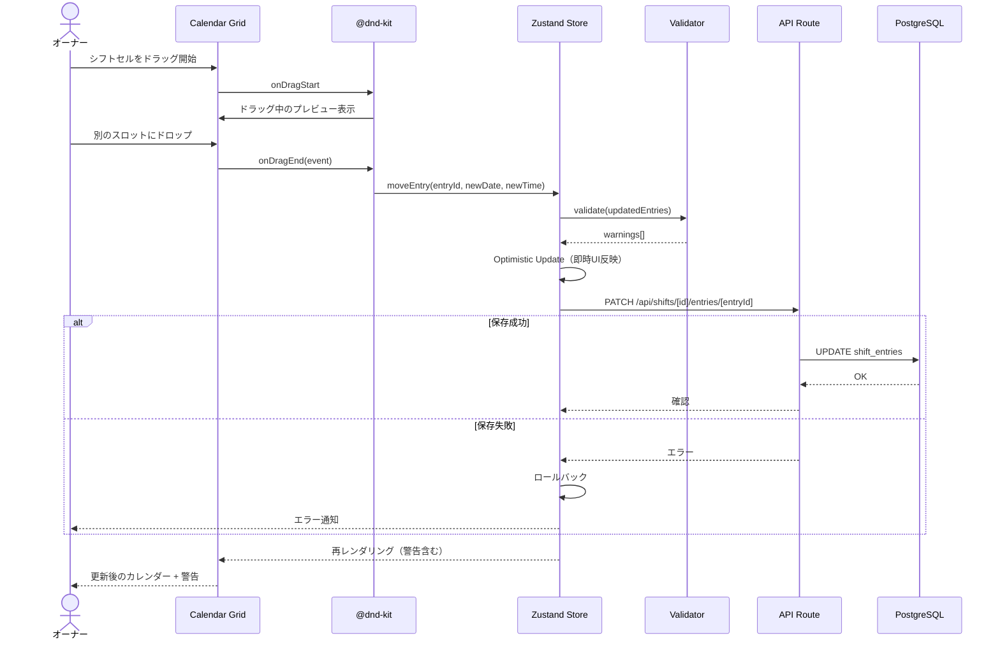

---

## 10. シーケンス図: PDF出力

> 参照元: 設計書 §4.4

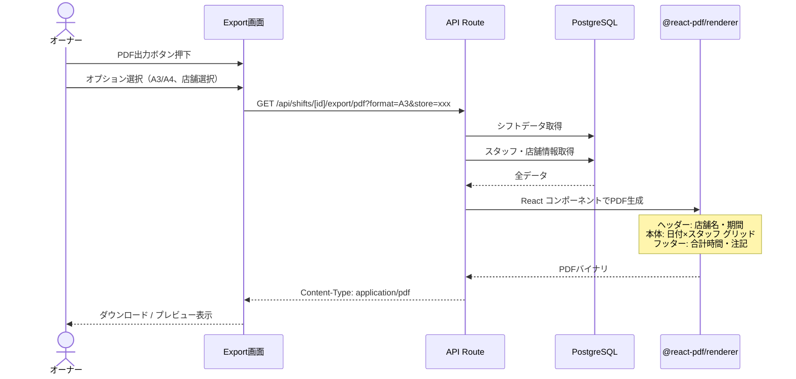

---

## 11. CI/CDパイプライン

> 参照元: 設計書 §7.3

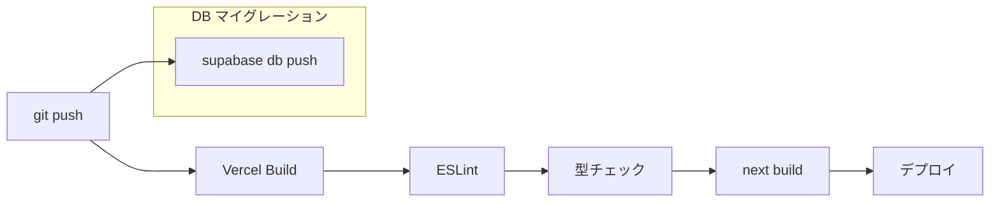
