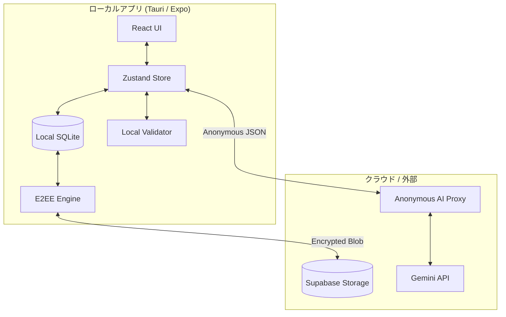
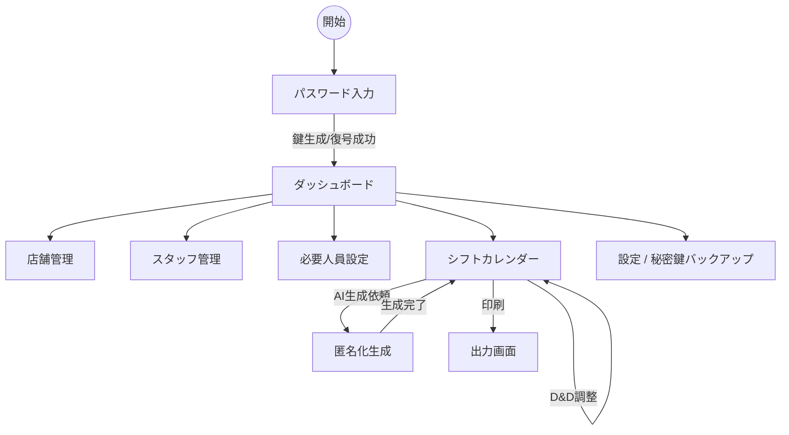
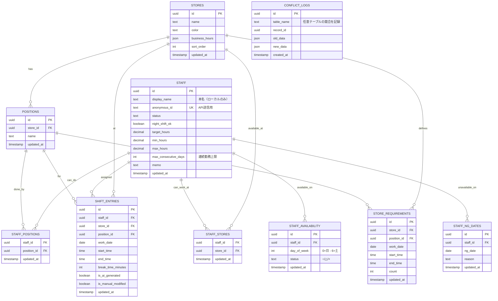
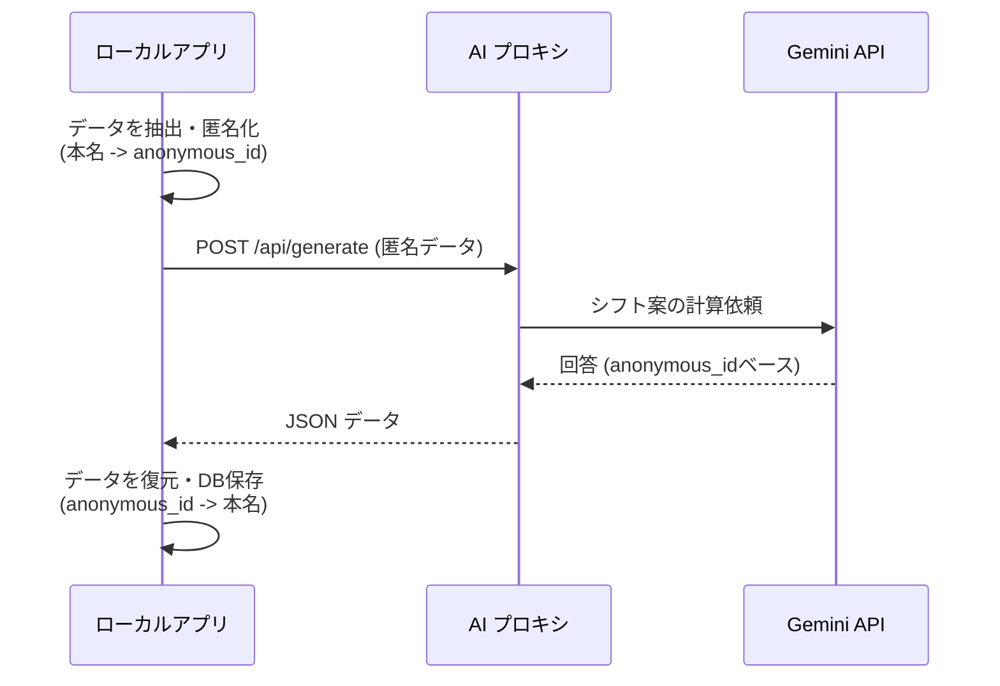
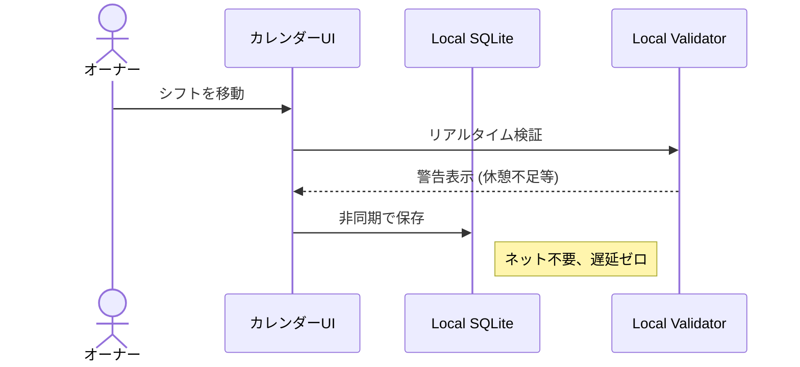
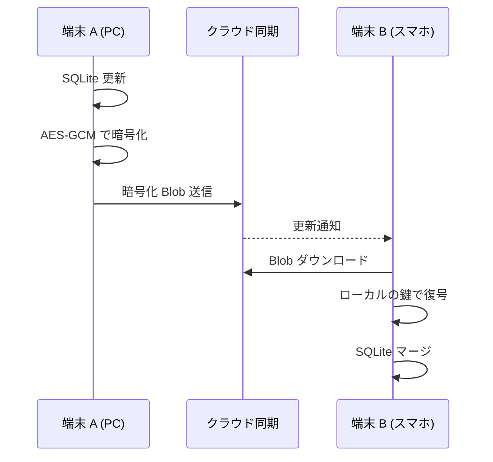
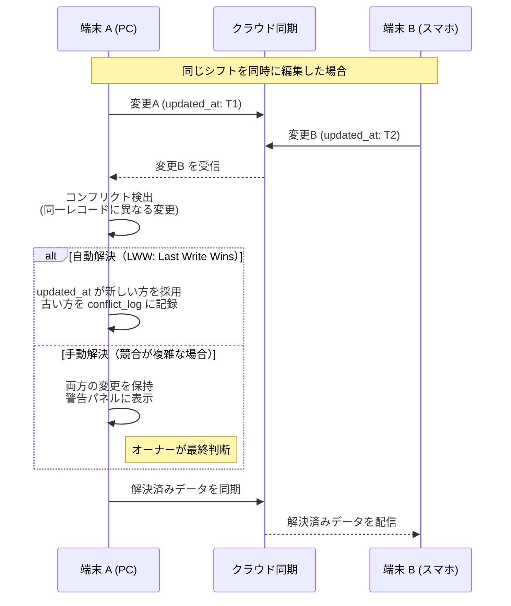
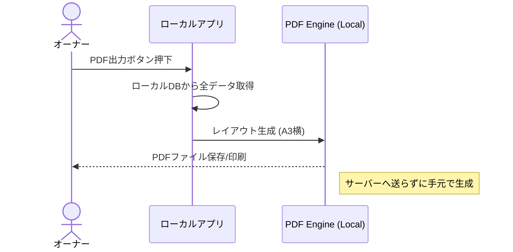
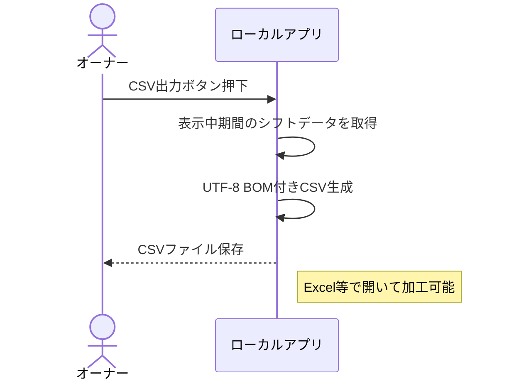

# 図解集 — AIシフト作成アプリ「ShiftCraft (Local-first)」

> **最終更新**: 2026-04-06
> **関連ドキュメント**: `20260406_requirements_local.md` / `20260406_design_local.md` (v2.1)

---

## 目次

1. [アーキテクチャ図 (Local-first 詳細)](#1-アーキテクチャ図-local-first-詳細)
2. [画面遷移図 (Mobile & Desktop)](#2-画面遷移図-mobile--desktop)
3. [ER図 (Local SQLite Schema)](#3-er図-local-sqlite-schema)
4. [シーケンス図: 匿名化 AI シフト生成](#4-シーケンス図-匿名化-ai-シフト生成)
5. [シーケンス図: D&D 編集 (Local Optimistic)](#5-シーケンス図-dd-編集-local-optimistic)
6. [シーケンス図: E2EE 暗号化同期](#6-シーケンス図-e2ee-暗号化同期)
7. [シーケンス図: 同期コンフリクト解決](#7-シーケンス図-同期コンフリクト解決)
8. [シーケンス図: PDF 出力フロー](#8-シーケンス図-pdf-出力フロー)
9. [シーケンス図: CSV 出力フロー](#9-シーケンス図-csv-出力フロー)

---

## 1. アーキテクチャ図 (Local-first 詳細)

---

## 2. 画面遷移図 (Mobile & Desktop)

---

## 3. ER図 (Local SQLite Schema)

---

## 4. シーケンス図: 匿名化 AI シフト生成

---

## 5. シーケンス図: D&D 編集 (Local Optimistic)

---

## 6. シーケンス図: E2EE 暗号化同期

---

## 7. シーケンス図: 同期コンフリクト解決

---

## 8. シーケンス図: PDF 出力フロー

---

## 9. シーケンス図: CSV 出力フロー

