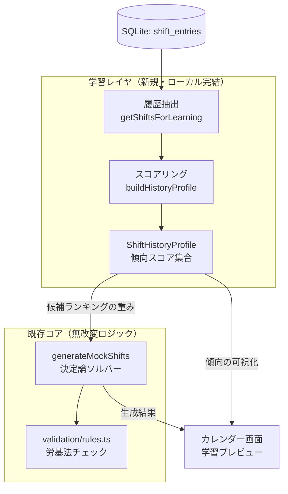
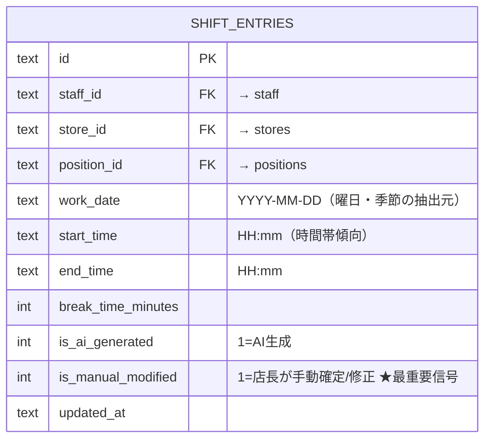
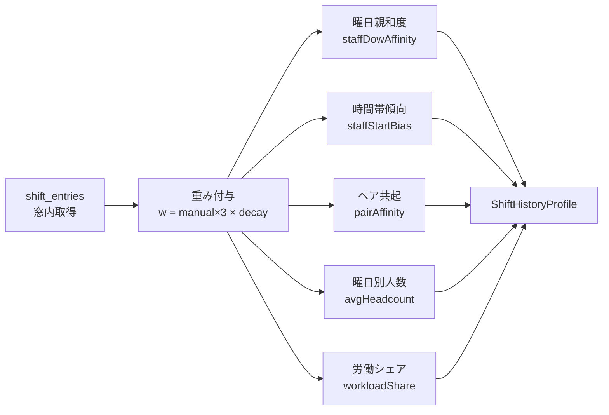
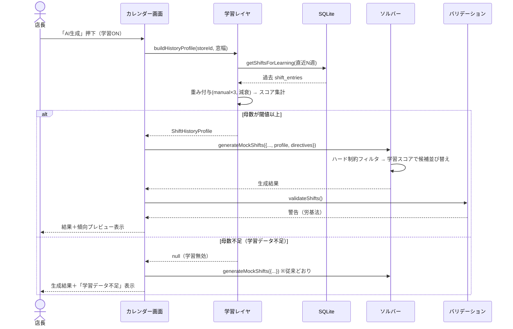

# システム設計書 — 過去シフトからの傾向学習機能（方式1: 統計抽出レイヤ）

- **対象アプリ**: ShiftCraft (Local-first)
- **作成日**: 2026-06-02
- **ステータス**: 設計（実装は試験後／8月以降を想定）
- **関連**: `20260406_design_local.md`（基盤設計）、`src/services/ai/`（AIアシスタント基盤・実装済み）

---

## 0. このドキュメントの意図（なぜ作るか）

「過去シフトからAIに学習させたい」という要望に対する設計。
ポイントは **モデルを訓練（ML/ファインチューニング）するのではなく、過去 `shift_entries` から店長の傾向を統計的に抽出し、既存の決定論ソルバーへ"重み"として注入する** こと。

### 方式選定理由
| 方式 | 採否 | 理由 |
|------|------|------|
| **統計抽出 → ソルバーに重み注入** | ✅ 採用 | local-first維持・ML基盤不要・少量データで機能・**説明可能**・既存アーキに乗る |
| LLMに履歴サマリを渡して directive 自動提案 | △ 任意拡張 | クラウド依存。統計層の上位オプションとして将来追加可 |
| ローカルMLモデル（回帰等）の訓練 | ✗ 不採用 | 1店舗数ヶ月ではデータ不足。統計集計に対する優位が乏しい |
| LLMファインチューニング | ✗ 不採用 | コスト・データ量・効果のいずれも見合わない。割当の精度向上にも繋がらない |

### 設計の鉄則
- **学習は「並び替え」だけに効かせる。** 出勤可否(`availability`)・NG日・労基法バリデーションといった**ハード制約は一切緩めない**。学習スコアは候補スタッフの優先順位を調整するのみ。
- **`is_manual_modified` を最重要の教師信号とする。** 店長が手動で確定/修正した枠＝「AIにこうしてほしかった」という明示的な意思表示。

---

## 1. スコープ

### 1.1 やること（MVP）
- 直近N週間の `shift_entries` から傾向プロファイル（`ShiftHistoryProfile`）を算出する。
- プロファイルを既存ジェネレータ `generateMockShifts` の候補ランキングに反映する。
- 店長が傾向を確認できる「学習プレビュー」を表示する（説明可能性）。

### 1.2 やらないこと（将来）
- 真の「負の信号」学習（AI提案を店長が**削除**した履歴の学習）→ 編集ログテーブルが必要なため後続フェーズ（§8.2）。
- クラウド/LLMによる傾向解釈（方式2）。
- 複数店舗をまたいだ学習。

---

## 2. アーキテクチャ

### 2.1 全体構成（学習レイヤの位置づけ）



学習レイヤは既存の `GenerationDirective`（AIアシスタントが生成する一時指示）と**並列**で、生成時に追加入力される。両者は併用可能（例:「過去傾向ベース＋今週だけ週末増員」）。

### 2.2 新規・改修ファイル

| 種別 | パス | 内容 |
|------|------|------|
| 新規 | `src/services/learning/types.ts` | `ShiftHistoryProfile` ほか型定義 |
| 新規 | `src/services/learning/profile.ts` | 履歴→プロファイル算出のコアロジック |
| 新規 | `src/db/queries/shift-history.ts` | 学習用の履歴取得クエリ |
| 改修 | `src/services/mock-ai-generator.ts` | `GenerateParams` に `profile?` を追加、候補 `.sort()` に学習スコアを加味 |
| 改修 | `src/components/calendar/GenerateButton.tsx` | プロファイル読込・生成への引き渡し |
| 新規 | `src/components/learning/LearningPreview.tsx` | 抽出した傾向の可視化UI |
| 改修 | `src/stores/useAiStore.ts` ないし新規 `useLearningStore.ts` | 学習ON/OFF・窓幅・重み設定の永続化（`app_settings`） |

---

## 3. データ設計

### 3.1 入力データ（既存テーブルを流用・スキーマ変更なし）

`shift_entries` を学習ソースとする。過去分は削除されず蓄積される（`deleteNonManualShifts` は再生成範囲のAI生成分のみ削除）。



**信号の重み付け（最重要）:**
各シフトレコードの寄与重みを
```
w(entry) = is_manual_modified ? W_MANUAL : 1.0     （W_MANUAL ≈ 3.0、設定可）
```
とする。手動確定枠は店長の明示的意思なので、AIが置いてそのまま通った枠の3倍の重みで傾向に反映する。

さらに古い週は影響を減衰させる（季節変動・人員入替への追従）:
```
w(entry) *= DECAY ^ (経過週数)                      （DECAY ≈ 0.95）
```

### 3.2 出力データ構造 `ShiftHistoryProfile`

```ts
// src/services/learning/types.ts
export interface ShiftHistoryProfile {
  storeId: string;
  windowWeeks: number;            // 集計対象期間
  sampleCount: number;            // 母数（シフト件数）。閾値未満なら学習無効
  // スタッフ×曜日の親和度（0..1）。出勤頻度ベース
  staffDowAffinity: Record<string, number[]>;   // staffId -> [日,月,...,土] の7要素
  // スタッフの典型開始時刻帯（分）。早番/遅番傾向
  staffStartBias: Record<string, number>;        // staffId -> 中央値(分)
  // よく一緒に入るペアの共起スコア（0..1）
  pairAffinity: Record<string, number>;          // "staffIdA|staffIdB"(昇順) -> score
  // 曜日×ポジションの平均配置人数（必要人数の提案に使う）
  avgHeadcount: Record<string, number[]>;        // positionId -> [日..土] の平均人数
  // スタッフ別の平均労働時間シェア（公平性の基準）
  workloadShare: Record<string, number>;         // staffId -> 平均シェア(0..1)
}
```

---

## 4. スコアリング・ロジック

### 4.1 パイプライン



### 4.2 各スコアの算出式

- **曜日親和度** `staffDowAffinity[staff][dow]`
  ```
  = Σ w(staffがdowに入った枠) / Σ w(その店舗のdowの全枠)
  ```
  「その曜日に何人入るか」で正規化し、0..1 に収める。出勤が多い曜日ほど高い。

- **時間帯傾向** `staffStartBias[staff]`：そのスタッフの開始時刻（重み付き）の中央値。早番/遅番の癖を表す。

- **ペア共起** `pairAffinity[A|B]`：同一 `work_date` に両者が入った重み付き回数を、各々の出勤数で正規化（Jaccard類似に近い）。

- **曜日別平均人数** `avgHeadcount[position][dow]`：`(dowのposition配置人数の重み付き合計) / (窓内のそのdowの出現週数)`。→ §6.2 の必要人数提案に使用。

- **労働シェア** `workloadShare[staff]`：窓内の総労働時間に占めるそのスタッフの割合。既存ソルバーの workload balance の「目標値」として使う。

### 4.3 ソルバーへの注入（候補ランキング）

既存 `mock-ai-generator.ts` の候補 `.sort()`（現状: ①勤務時間が少ない順 → ②○を△より優先）に、学習スコアを**加点**として差し込む。重要なのは順序: **prefer指定 > 学習スコア > 既存の均等化** とし、ハード制約フィルタ（出勤可否・NG・重複）はソート前に通過済みである点。

```
candidateScore(staff, req) =
      ALPHA_PREFER  * (prefer_staff指定か)            // 既存directive優先
    + ALPHA_AFFINITY* staffDowAffinity[staff][dow]    // 学習: 曜日親和度
    + ALPHA_TIME    * timeMatch(staff, req)           // 学習: 時間帯一致
    + ALPHA_PAIR    * pairBonus(staff, 既割当者)       // 学習: 相性
    - ALPHA_BALANCE * 既割当時間(staff)                // 既存: 均等化（負の係数）
```
スコア降順で上位 `neededCount` 名を採用。`profile` 未指定時は全 ALPHA_*（BALANCE以外）が無効化され、**現行挙動と完全に一致**（後方互換）。

> 設計判断: 係数 `ALPHA_*` は `app_settings` で調整可能にし、初期値は均等化を学習が上書きしすぎない控えめな値に設定する。学習はあくまで「同じくらいの候補なら店長の癖に寄せる」程度の効き方にする。

---

## 5. 生成シーケンス



---

## 6. UI 設計

### 6.1 学習プレビュー（説明可能性）
生成前後に、抽出された傾向を自然文で提示する。これが汎用シフトアプリにない差別化点。
- 例: 「田中さんは金曜の出勤が多い傾向（親和度 0.8）」
- 例: 「土曜は平均4.2名を配置」
- 例: 「佐藤さんと鈴木さんは同じ日に入ることが多い」

### 6.2 必要人数の提案（任意・確認制）
`avgHeadcount` から「この曜日は普段◯名」を提案。採用するかは店長が承認 → `store_requirements` に反映。
**AIアシスタントPhase 2 の永続アクション確認UIと同じ仕組みを再利用**（誤更新防止のため必ず確認を挟む）。

### 6.3 設定
- 学習 ON/OFF
- 集計窓幅（既定: 12週）
- 手動枠の重み `W_MANUAL`（既定: 3.0）／減衰率（既定: 0.95）

---

## 7. エッジケース・フォールバック

| ケース | 挙動 |
|--------|------|
| 履歴が閾値未満（例 < 30件） | 学習を無効化し従来生成にフォールバック。UIに「学習データ不足」表示 |
| 新人（履歴なし） | 親和度0＝中立。既存の均等化ロジックに委ねる |
| 退職者が履歴に存在 | 現 `staff` に存在しないidは集計から除外 |
| 季節変動・シフト傾向の変化 | 減衰率で古いデータの影響を低減 |
| 学習スコアが偏りすぎ | ALPHA係数を控えめにし、ハード制約は不可侵なので破綻しない |

---

## 8. 実装フェーズ

### 8.1 MVP（方式1）
1. `shift-history.ts` クエリ ＋ `profile.ts` スコアリング（純ロジック・単体テスト容易）
2. `mock-ai-generator.ts` に `profile?` 注入（directives と同様、未指定で現行同一）
3. 学習プレビューUI ＋ 設定
4. 回帰確認: `profile` 無しで既存生成結果と差分なし

### 8.2 将来拡張
- **負の信号学習**: 軽量な `shift_edit_log`（AI提案→店長が削除/差替えの記録）を追加し、「店長が嫌う配置」を減点。真の"修正学習"。
- **方式2併用**: プロファイルを自然文サマリ化し、LLM（実装済みClaude基盤）に directive を自動提案させる。
- 必要人数提案の自動化（季節・曜日テンプレート）。

---

## 9. 自己監査（Audit）

- ✅ **要件と設計の整合**: 「過去シフトから学習」を、local-first・ML不要・説明可能の形で満たす。
- ✅ **既存スタックで実装可能**: SQLite + TS のみ。新規依存なし（AIアシスタントと違い外部API不要）。
- ✅ **スキーマ変更なし（MVP）**: 既存 `shift_entries` を流用。§8.2 の負信号学習でのみ新テーブル追加。
- ✅ **ハード制約の不可侵**: 学習は候補の並び替えのみ。労基法・出勤可否・NGは従来どおり厳守。
- ✅ **後方互換**: `profile` 未指定で現行挙動と完全一致。
- ⚠️ **要チューニング**: ALPHA係数・W_MANUAL・窓幅は実データでの調整が前提。初期値は控えめに。
- ⚠️ **運用前提**: 学習効果には数週間〜の履歴蓄積が必要。導入直後は従来生成と大差ない点を店長に説明する。
